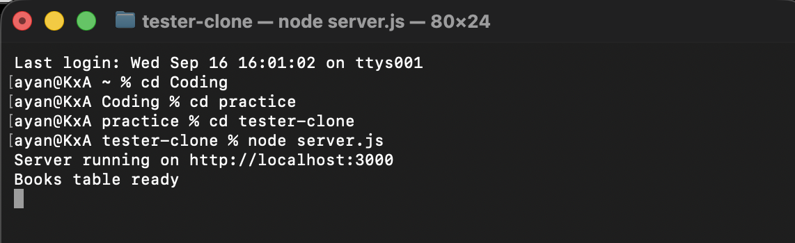
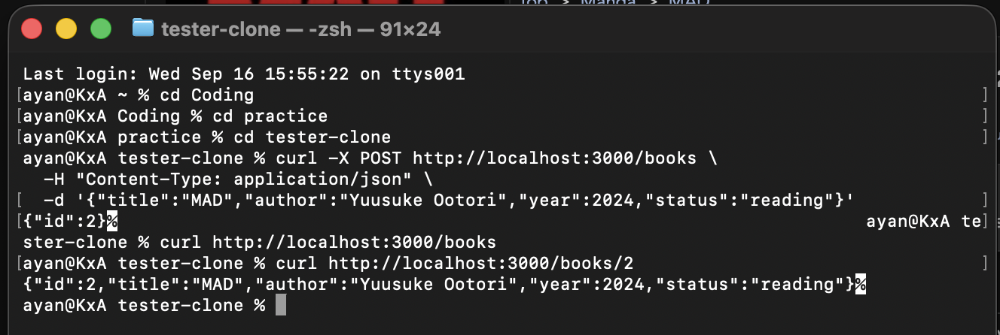

# 📚 Book Management API

A RESTful backend API for managing a book collection, built with **Express** and **SQLite**. Supports full CRUD operations with persistent storage.

---

## Tech Stack

- **Backend:** Node.js, Express
- **Database:** SQLite3
- **Testing:** cURL (command line)

---

## Setup

1. `cd` into the project folder
2. `npm install`
3. `node server.js`
4. You should see:
    Server running on http://localhost:3000
    Books table ready

**Leave this terminal running.** The server must stay up while you test.

5. Open a SECOND terminal to send requests

The database (`database.db`) and `books` table are created automatically on first run.



---

## API Endpoints

Base URL: `http://localhost:3000`

| Method | Endpoint | Description |
|--------|----------|-------------|
| GET | `/books` | Get all books |
| GET | `/books?status=reading` | Filter books by status |
| GET | `/books/:id` | Get a single book by ID |
| POST | `/books` | Add a new book |
| PUT | `/books/:id` | Update an existing book |
| DELETE | `/books/:id` | Delete a book |

**Allowed status values:** `to-read`, `reading`, `completed`

---

## Example Requests (cURL)

### Get a book by id
```bash
curl http://localhost:3000/books/1
```
### Add a new book
```bash
curl -X POST http://localhost:3000/books \
  -H "Content-Type: application/json" \
  -d '{"title":"1984","author":"George Orwell","year":1949,"status":"completed"}'
```

### Delete a book
```bash
curl -X DELETE http://localhost:3000/books/1
```

